# SMP2 - TP6 : Création d'un Monopoly

## Sommaire
- [SMP2 - TP6 : Création d'un Monopoly](#smp2---tp6--création-dun-monopoly)
  - [Sommaire](#sommaire)
  - [1. Préambule - Création du repository Git](#1-préambule---création-du-repository-git)
  - [2. Règles du jeu](#2-règles-du-jeu)
    - [2.1. Tour de jeu](#21-tour-de-jeu)
    - [2.2. Options à chaque tour](#22-options-à-chaque-tour)
    - [2.3. Double au dé](#23-double-au-dé)
    - [2.4. 🏦 Règles spéciales](#24--règles-spéciales)
      - [2.4.1. Case Départ](#241-case-départ)
      - [2.4.2. Case Prison](#242-case-prison)
      - [2.4.3. Taxes et impôts](#243-taxes-et-impôts)
      - [2.4.4. Propriétés hypothéquées](#244-propriétés-hypothéquées)
    - [2.5. 🏘️ Construction](#25-️-construction)
    - [2.6. 💰 Faillite](#26--faillite)
    - [2.7.🏆 Fin du jeu](#27-fin-du-jeu)
  - [3. Travail à faire](#3-travail-à-faire)
    - [3.1. Spécifications](#31-spécifications)
      - [Gestion des groupes de cartes](#gestion-des-groupes-de-cartes)
      - [Conception globale](#conception-globale)
    - [3.2. Conception](#32-conception)
      - [Classe Joueur](#classe-joueur)
      - [Classe Case](#classe-case)
      - [Classe Couleur](#classe-couleur)
      - [Classe MJ](#classe-mj)
    - [3.3. Jeux d’essais](#33-jeux-dessais)
      - [3.3.1. Classe Case](#331-classe-case)
        - [Description](#description)
        - [Exemples de tests](#exemples-de-tests)
  - [4. Amélioration](#4-amélioration)
    - [Classe monétaire](#classe-monétaire)
    - [Le polymorphisme](#le-polymorphisme)
  - [5. Conclusion](#5-conclusion)

---

## 1. Préambule - Création du repository Git
Pour réaliser ce TP, commencez par créer un repository Git en suivant les consignes suivantes :
- Donnez à votre groupe un nom de la forme **NOM1-NOM2-NOM3-NOM4**.
- Partagez vos livrables : code, diagrammes, description des choix de conception, algorithmes et jeux d'essais.

## 2. Règles du jeu

<div style="position: relative; text-align: center; color: white;">

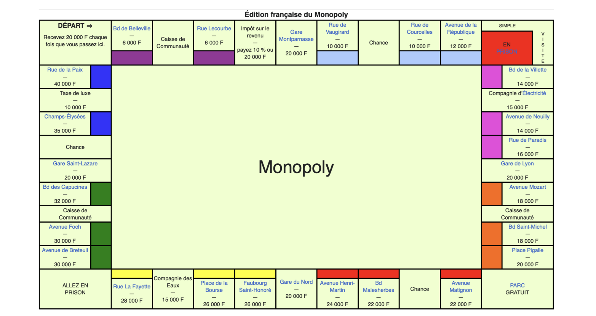

<div style="position: absolute; top: 50%; left: 50%; transform: translate(-50%, -50%); font-size: 24px;">
Plateau de Monopoly
</div>

### 2.1. Tour de jeu
Chaque joueur joue à son tour dans le sens des aiguilles d’une montre :
   - Lancez les **deux dés** et avancez votre pion du nombre indiqué.
   - Appliquez l’effet de la case sur laquelle vous arrivez.

### 2.2. Options à chaque tour
- **Acheter une propriété** : 
   - Si vous arrivez sur une propriété non possédée, vous pouvez l’acheter au prix indiqué sur la case.
   - Si vous refusez, le banquier met la propriété aux enchères.
- **Payer un loyer** : 
   - Si vous arrivez sur une propriété appartenant à un adversaire, vous payez le loyer indiqué sur le titre de propriété (modifié si des maisons ou hôtels sont construits).
- **Piocher une carte** :
   - Si vous tombez sur une case **"Chance"** ou **"Caisse de Communauté"**, piochez une carte et suivez ses instructions.
- **Construire des maisons ou hôtels** (si applicable) :
   - À votre tour, vous pouvez acheter des maisons/hôtels sur vos propriétés si vous possédez tout un groupe de couleur.

### 2.3. Double au dé
- Si vous faites un double (deux dés identiques), jouez à nouveau.
- Si vous faites **trois doubles consécutifs**, vous allez directement en prison.

---

### 2.4. 🏦 Règles spéciales

#### 2.4.1. Case Départ
- Chaque fois que vous passez ou atterrissez sur la case "Départ", recevez **200 M$**.

#### 2.4.2. Case Prison
- Vous allez en prison si :
   - Vous tombez sur la case "Allez en prison".
   - Vous piochez une carte "Allez en prison".
   - Vous faites trois doubles consécutifs.
- Pour sortir de prison :
   - Payez **50 M$** au début de votre tour.
   - Utilisez une carte **"Sortie de prison"**.
   - Faites un double en lançant les dés (vous avancez alors du total des dés).

#### 2.4.3. Taxes et impôts
- Payez le montant indiqué si vous atterrissez sur une case taxe (Impôt sur le revenu, Taxe de luxe, etc.).

#### 2.4.4. Propriétés hypothéquées
- Une propriété peut être hypothéquée pour obtenir de l’argent de la banque.
- Vous devez payer la valeur de l’hypothèque + 10 % pour lever l’hypothèque.

---

### 2.5. 🏘️ Construction

1. **Conditions pour construire** :
   - Vous devez posséder **toutes les propriétés d’un groupe de couleur**.
   - Les constructions doivent être **équilibrées** : vous ne pouvez pas construire une deuxième maison sur une propriété tant que toutes les propriétés du groupe n’ont pas une maison.
2. **Prix** :
   - Indiqué sur le titre de propriété.
3. **Hôtels** :
   - Une fois 4 maisons construites sur une propriété, vous pouvez les échanger contre un hôtel.

---

### 2.6. 💰 Faillite

- Si vous devez payer plus que ce que vous possédez, vous êtes en faillite.
- Vous devez alors céder vos propriétés et votre argent à votre créancier.
- Si vous êtes en faillite envers la banque, toutes vos propriétés sont remises aux enchères.

---

### 2.7.🏆 Fin du jeu

- Le jeu continue jusqu’à ce qu’un seul joueur reste en lice, tous les autres étant en faillite.
- **Option** : Fixez une limite de temps. Le joueur le plus riche à la fin gagne.

---

## 3. Travail à faire
### 3.1. Spécifications
Pour répondre aux attentes du TP, nous avons décidé de faire une architecture où seule la classe `MJ` avait une réelle réflexion. Les autres classes ont pour rôle de :
- **stocker** les informations nécessaires,
- **mettre à jour** ces informations,
- **communiquer** leurs données avec les autres classes.

#### Gestion des groupes de cartes
Pour stocker les groupes de cartes, nous avons créé une classe `Couleurs`. Cette classe stocke les informations relatives à un groupe de couleur. Lorsqu’un groupe possède sur toutes les cases le même propriétaire, les cases deviennent **constructibles**.

#### Conception globale
Nous obtenons alors une conception qui suit le diagramme de classe suivant :
<div style="position: relative; text-align: center; color: white;">


<div style="position: absolute; top: 50%; left: 50%; transform: translate(-50%, -50%); font-size: 24px;">
Diagramme de classe
</div>

### 3.2. Conception 

#### Classe Joueur
Le but de cette classe est de créer les profils des joueurs du Monopoly, ils doivent etre capable de stocker leurs informations:
- Argent,
- position,
- si ils sont en prison,
- leurs cartes spéciales (communauté, chance, gare, service publique).
Elle est capable de transmettre ses informations et de les mettres à jours graces aux méthodes qui conviennent.
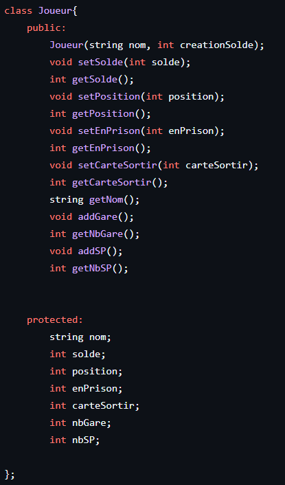

#### Classe Case
Cette classe est une classe qui possède beaucoup de spécificités différentes, pour cela nous avons utilisé l'héritage, nous avons d'abord séparé en deux types de classes filles:
- les actions
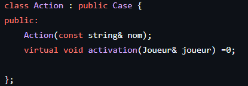
- les actifs
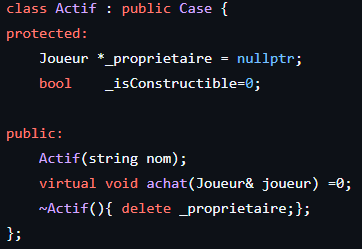
Cette séparation a pour but de séparer les classes qui agissent uniquement sur le joueur et les cases ou les intéractions vont dans les 2 sens (par exemple: achat de la carte, payement du loyer). 
Une fois cette séparation effectué nous avons créés de nouvelles classes filles correspondants a chaque types de cases différentes, voici les classes filles de Action:
- Chance
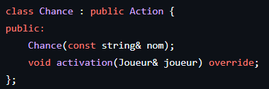
- Communauté
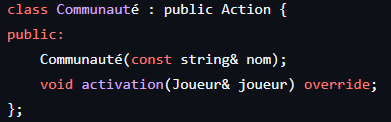
- AllerPrison
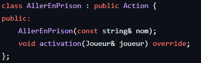
- Impots
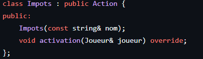
- Taxe De Luxe
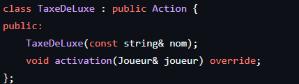
Et les classes filles de Actif:
- Gare
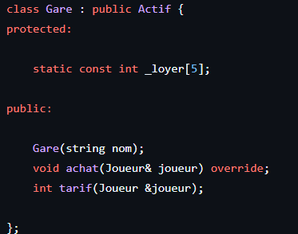
- ServPublic
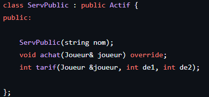
- Terrain
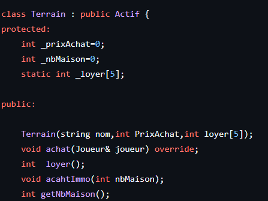

Une des spécificités de cette conception est que les classes `Actif` et `Action` sont des classes virtuelles pures. Elles possèdent toutes les deux une méthode virtuelle pure.  
Celle-ci est utilisée dans les classes filles, permettant d'avoir une déclaration commune mais une définition qui s'ajuste aux besoins de chaque classe.  
Du côté des classes filles de la classe `Actif`, on retrouve également des tableaux qui, selon les besoins, sont instanciés en static. 

#### Classe Couleur
Pour ce qui est de la classe `Couleur`, la conception a été plutôt laborieuse. Nous avons d'abord eu l'idée d'une classe qui, finalement, s'est plutôt rapprochée d'un objet unique.  
Nous avons donc modifié la conception pour que la classe `Couleur` soit plus cohérente dans le projet. Le Maître du Jeu possède le vecteur de couleurs, et chaque couleur possède son propre vecteur de cases.  
L'objectif de cette classe est de permettre de savoir si la couleur est constructible ou non. À chaque achat, une mise à jour est effectuée pour vérifier le propriétaire des autres cases de la même couleur.  
Un joueur peut également obtenir la liste des différentes cases constructibles.
```

Tu peux copier et coller ce texte dans ton fichier `.md`.

#### Classe MJ

### 3.3. Jeux d’essais
#### 3.3.1. Classe Case 

##### Description
Réalisation des jeux d'essaies sur la classe Case 

##### Exemples de tests
1. **joueur qui tombe sur une case Impots** :
   - **Entrée** : un joueur tombe sur une case Impots.
   - **Action attendue** : Le joueur perd 200 mono. 
   - **Résultat** :
   

2. **joueur qui tombe sur une case Taxe de luxe** :
   - **Entrée** : un joueur tombe sur une case taxe de luxe .
   - **Action attendue** : Le joueur perd 200 mono. 
   - **Résultat** :
   

3. **joueur qui tombe sur une case Chance** :
   - **Entrée** : un joueur tombe sur une case Chance
   - **Action attendue** : Le joueur gagne 200 mono ou perd 200 mono.
   - **Résultat** :
   
   

4. **joueur qui tombe sur une case Communauté** :
   - **Entrée** : un joueur tombe sur une case Communauté
   - **Action attendue** : Le joueur gagne 250 mono ou perd 200 mono. 
   - **Résultat** :
   
   


## 4. Amélioration
### Classe monétaire
Nous aurions pu créé une classe monétaire qui remplacerait toutes les classes donnant ou retirant de l'argent au joueur grâce aux méthodes virtuelles de la classe `Action`. Lors de la réalisation, nous avons différencié chaque case (taxe de luxe, impôts, ...).  
Le fait de réaliser cette classe aurait facilité l'utilisation et évité des confusions. De plus, les cases sans aucune activité (case départ, simple visite, ...) auraient pu être créées via cette classe en mettant la transaction à 0.

### Le polymorphisme
L'utilisation du polymorphisme aurait pu être très utile dans la classe `Case`, notamment dans le rôle du Maître du Jeu. Lorsque le plateau est créé, on indique que le tableau est de type `Case`. Or, lors de l'instanciation des cases, il existe plusieurs types de cases différents.  
Pour résoudre ce problème, nous avons utilisé du `static_cast`. L'utilisation du polymorphisme ici aurait grandement facilité l'implémentation du plateau.

## 5. Conclusion
Ce projet permet d’appliquer les concepts d’objet, d’héritage, et de gestion de projet en équipe. Le rendu final comprend :
- Code commenté.
- Diagrammes UML.
- Documentation des choix de conception.
- Jeux de tests montrant le bon fonctionnement.

---
