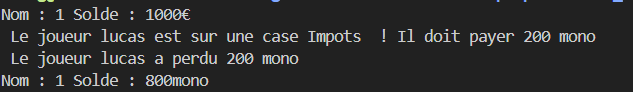
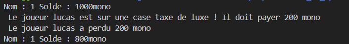
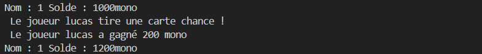
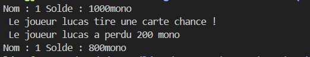
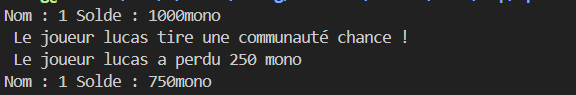
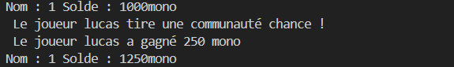

# SMP2 - TP6 : Création d'un Monopoly

## Sommaire
- [1. Préambule - Création du repository Git](#1-préambule---création-du-repository-git)
- [2. Règles du jeu](#2-règles-du-jeu)
  - [2.1. Principes généraux](#21-principes-généraux)
  - [2.2. Actions possibles](#22-actions-possibles)
  - [2.3. Conditions de victoire](#23-conditions-de-victoire)
- [3. Travail à faire](#3-travail-à-faire)
  - [3.1. Spécifications](#31-spécifications)
  - [3.2. Conception (Diagrammes)](#32-conception-diagrammes)
  - [3.3. Algorithmes](#33-algorithmes)
  - [3.4. Jeux d’essais](#34-jeux-dessais)
   - [3.4.1. Classe Case](#341-classe-case)
- [4. Conclusion](#4-conclusion)

---

## 1. Préambule - Création du repository Git
Pour réaliser ce TP, commencez par créer un repository Git en suivant les consignes suivantes :
- Donnez à votre groupe un nom de la forme **NOM1-NOM2-NOM3-NOM4**.
- Ajoutez un fichier `README.md` listant les membres de l’équipe.
- Partagez vos livrables : code, diagrammes, description des choix de conception, algorithmes et jeux d'essais.

## 2. Règles du jeu
### 2.1. Principes généraux
Le Monopoly est un jeu de société pour 2 à 8 joueurs, utilisant de l'argent fictif, des propriétés, et des cartes. Chaque joueur avance sur un plateau en lançant deux dés et exécute une action en fonction de la case où il s’arrête.

### 2.2. Actions possibles
Les actions dépendent de la case :
- **Propriété libre** : Achat ou mise aux enchères.
- **Propriété d’un adversaire** : Paiement de loyers.
- **Cases spéciales** : Chance, Caisse de communauté, Impôts, etc.
- **Prison** : Les joueurs peuvent être emprisonnés et doivent payer pour sortir ou attendre.

### 2.3. Conditions de victoire
Le vainqueur est le dernier joueur en jeu, n’ayant pas fait faillite.

## 3. Travail à faire
### 3.1. Spécifications
Décrivez les fonctionnalités attendues et les règles du jeu implémentées. Listez les classes et leurs relations.

### 3.2. Conception (Diagrammes)
Réalisez des diagrammes UML pour modéliser le jeu :
- Diagrammes de classes pour représenter les joueurs, le plateau, et les cartes.
- Diagrammes de séquence pour illustrer les interactions principales.

### 3.3. Algorithmes
Expliquez les choix algorithmiques pour la gestion des actions de jeu :
- Lancer les dés.
- Gérer l’achat, les enchères, ou la construction.
- Implémenter les conditions de victoire.

### 3.4. Jeux d’essais
Fournissez des exemples de tests :
- Scénarios simples : Achat de propriété, paiement de loyer.
- Scénarios complexes : Construction d’hôtels, faillite d’un joueur.

### 3.4.1. Classe Case 

#### Description
Réalisation des jeux d'essaies sur la classe Case 

#### Exemples de tests
1. **joueur qui tombe sur une case Impots** :
   - **Entrée** : un joueur tombe sur une case Impots.
   - **Action attendue** : Le joueur perd 200 mono. 
   - **Résultat** :
   

2. **joueur qui tombe sur une case Taxe de luxe** :
   - **Entrée** : un joueur tombe sur une case taxe de luxe .
   - **Action attendue** : Le joueur perd 200 mono. 
   - **Résultat** :
   

3. **joueur qui tombe sur une case Chance** :
   - **Entrée** : un joueur tombe sur une case Chance
   - **Action attendue** : Le joueur gagne 200 mono ou perd 200 mono.
   - **Résultat** :
   
   

4. **joueur qui tombe sur une case Communauté** :
   - **Entrée** : un joueur tombe sur une case Communauté
   - **Action attendue** : Le joueur gagne 250 mono ou perd 200 mono. 
   - **Résultat** :
   
   

## 4. Conclusion
Ce projet permet d’appliquer les concepts d’objet, d’héritage, et de gestion de projet en équipe. Le rendu final comprend :
- Code commenté.
- Diagrammes UML.
- Documentation des choix de conception.
- Jeux de tests montrant le bon fonctionnement.

---
